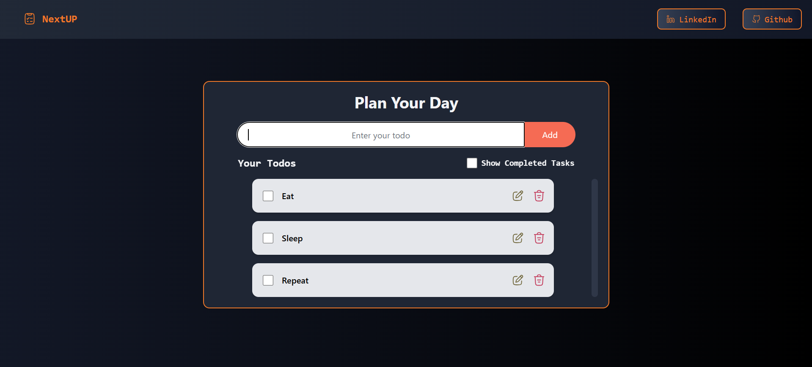

# NextUp - Plan Your Day

NextUp is a simple and intuitive to-do list app designed to help you organize your day. With an easy-to-use interface, it allows users to add, edit, mark, and delete tasks, ensuring you stay productive. Whether you're at home or on the go, NextUp will keep your tasks in check!

## Features

- **Add Tasks**: Add tasks to your to-do list to keep track of your daily goals.
- **Edit Tasks**: Modify tasks you've already added to keep them up to date.
- **Mark as Completed**: Easily mark tasks as completed to track your progress.
- **Delete Tasks**: Remove tasks from your list when they are no longer needed.
- **Persistent Storage**: All tasks are saved locally in the browser, ensuring they persist even after a page reload.
- **Responsive Design**: Optimized for both desktop and mobile devices.

## Screenshots



## Tech Stack

- **Frontend**: React, Tailwind CSS
- **Backend**: None (client-side only, data is stored in `localStorage`)
- **Icons**: Custom SVG icons for edit and delete buttons
- **State Management**: React hooks (`useState`, `useEffect`, `useRef`)

## Prerequisites

Make sure you have the following installed on your machine:

- [Node.js](https://nodejs.org/) (for running the app locally)
- [npm](https://www.npmjs.com/) (Node package manager)

## Installation

1. Clone this repository to your local machine:

   ```bash
   git clone https://github.com/yourusername/nextup.git

   ```

2. Open the Code in terminal and run
   ```bash
   npm run dev
   ```
